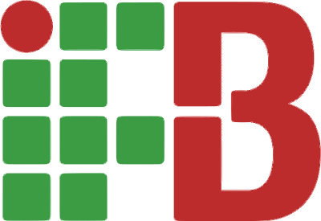

### Eae! Me chamo Tiago 👍

Sou estudante do&nbsp;
<a href="https://www.ifb.edu.br" title="Página do Instituto Federal de Brasília" target="_blank">
  
<a>, e estou cursando **Sistemas para Internet**.
 
  
🌱 Atualmente estou aprendendo Node.js!
 

---
#### Linguagens

---

<!-- - 🔭 I’m currently working on ...
- 🌱 I’m currently learning ...
- 👯 I’m looking to collaborate on ...
- 🤔 I’m looking for help with ...
- 💬 Ask me about ...
- 📫 How to reach me: ...
- 😄 Pronouns: ...
- ⚡ Fun fact: ... -->

###### _Note que o uso das linguagems não é correlacionado com o meu nível de experiência na mesma._

#### Contatos

Baixe meu currículo [aqui](https://github.com/Tiagocf2/Tiagocf2/raw/main/Corriculum-Vitae--Tiago-Civatti-Frausino.pdf).  
Cheque meu [portifólio](https://tiagocf2.github.io/) (ainda em desenvolvimento...)
